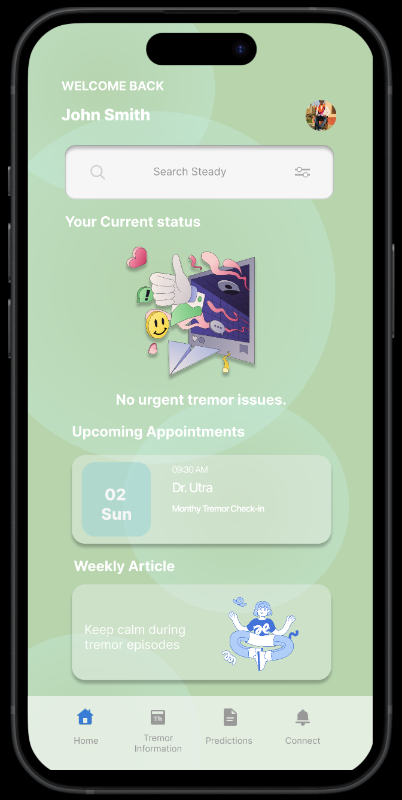
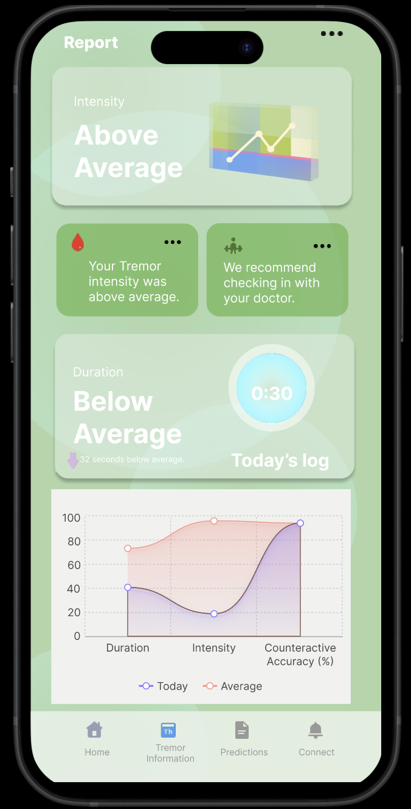
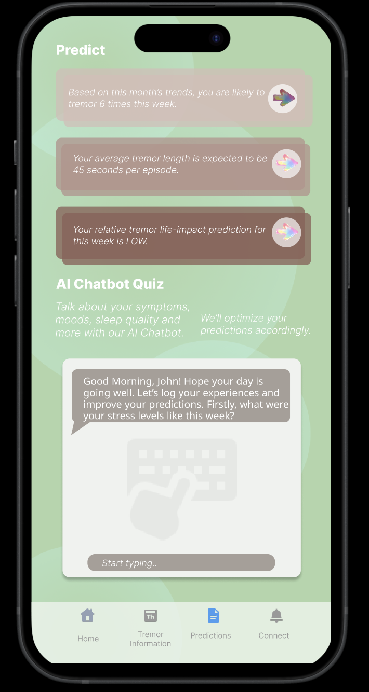
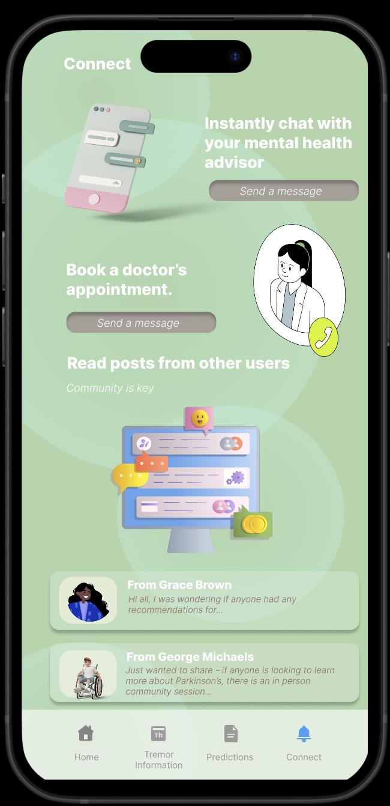

<h1 align="center">
  Steady
</h1>

# TremorTracker: Advanced Tremor Monitoring & Insights

> **TremorTracker** brings state-of-the-art tremor monitoring, predictive insights, and collaboration with healthcare professionals to your fingertips. This project is actively being developed to empower individuals with actionable data and tools to manage tremor-related conditions effectively.

Utilizing technologies like HealthKit, CoreML, and AI-driven predictions, TremorTracker offers a comprehensive suite of tools for tremor management and professional healthcare collaboration.

## Some screenshots

<table>
  <tr>
    <td align="center"> Home</td>
    <td align="center"> Report</td>
    <td align="center"> Prediction</td>
    <td align="center"> Connect</td>
  </tr>
</table>

## Key Features ✨

- **Tremor Monitoring Dashboard:** Track tremor metrics like intensity, duration, and patterns over time. Gain actionable insights to understand your tremor trends and when to seek medical attention.
- **AI-Powered Predictions:** Utilize advanced machine learning models to forecast tremor frequency and severity based on your history and lifestyle inputs.
- **Symptom Logging:** Log symptoms, stress levels, sleep quality, and more to improve prediction accuracy and monitor progress.
- **Doctor Collaboration:** Add healthcare professionals, book appointments, and share detailed tremor reports securely. QR code functionality ensures simple and secure data sharing.
- **Comprehensive Reports:** Visualize trends and generate interactive reports for better understanding and decision-making.
- **Community Connection:** Engage with a supportive community, read user stories, and share experiences for mutual support.
- **Educational Resources:** Access expert-curated articles and resources to better understand tremors and how to manage them effectively.
- **HealthKit Integration:** Sync with HealthKit to retrieve health metrics, such as sleep data and heart rate, for a holistic view of your health.

## Technologies Used

- **HealthKit:** Seamlessly integrates health data from your device.
- **CoreML:** Powers predictive models for tremor insights and analysis.
- **AI Chatbot:** Offers personalized suggestions and answers to your queries for better health management.
- **Secure Data Sharing:** QR codes ensure simple and safe sharing of health data with doctors and caregivers.
- **Interactive Dashboards:** Combines advanced UI with comprehensive data visualization for user-friendly analytics.
